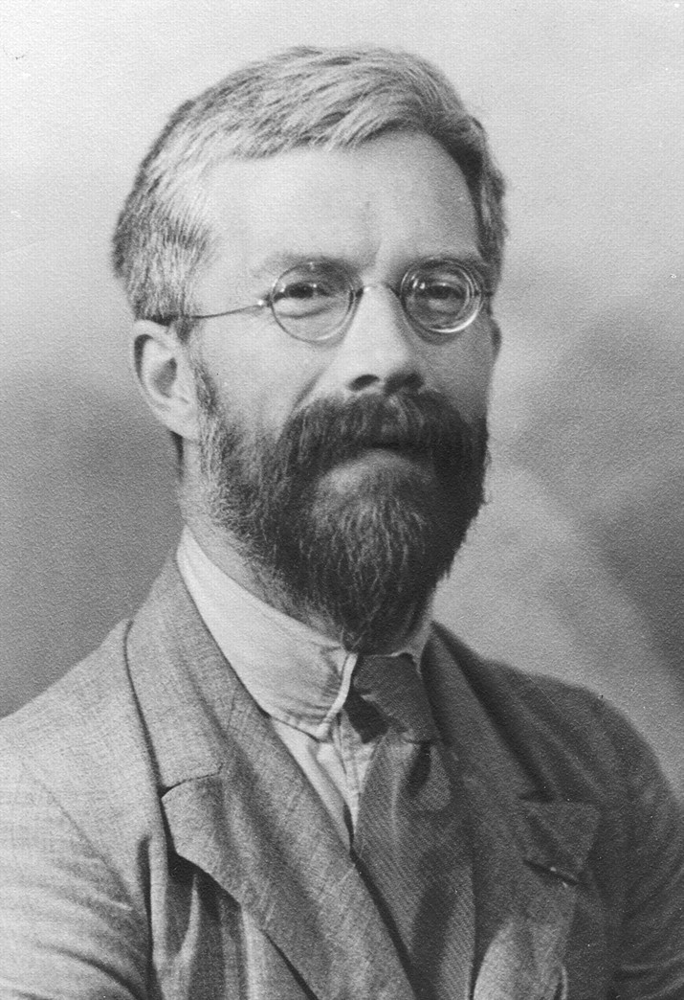

# Classification

So far we have examined how to compare the means of more than two samples:
- Multiple-sample testing
- Analysis of variance (ANOVA)
- Multivariate analysis of variance (MANOVA)

Next we study **classification**, with a particular focus on the *linear discriminant analysis* method. Some topics:
1. The classification problems
2. Bayes’ rule in classification
3. Linear discriminant analysis

# Qualitative variables

- Qualitative, or categorical, variables are very common in many datasets. They naturally reflect the discrete (or unordered) properties of observations.  
- When a qualitative variable contains only two outcomes, it is also called a *binary variable*.

Examples of unordered variables:
- Gender, blood type, smoking history, eye color of patients.
- The political party that a voter might vote for.
- Four nucleobases (A,G,T,C) of a DNA double helix.
- Nationalities of students in a department.
- Authenticity of a bank note (recall the swiss banknotes dataset).
- Location of pottery shards (recall the pottery dataset).

# Classification

- The process to predict a qualitative variable is called *classification*. Or we can say that
we classify that observation into a class/group/category. The statistical tools to classify the observations are called *classifiers*.

Examples:
- A patient arrives at the emergency room with a set of symptoms that could possibly be
attributed to one of the three medical conditions. Which one of the three does this patient
have?
- An online banking service must be able to determine whether or not a transaction being
processed on the site is fraudulent, on the basis of the user’s IP address, transaction history, etc.
- On the basis of DNA sequence data for a number of patients with and without a given
disease, a biologist would like to determine which DNA mutations are dependent (disease-causing) and which are not.


## Classification versus Regression

Classification problems are different, but connected to regression problems!

### Classification

- Predict qualitative variables
- Rarely interested in population parameters
- With or without a response variable
- Many methods first predict the probability of each category. In this sense, they behave like regression methods

### Regression

- Predict quantitative variables
- Inference on population parameters
- Require a response variable to formulate the problem
- Response variable can be qualitative (e.g., logistic regression)

## Two Types of Classification

- In general, there are two types of classification problems: *supervised* and *un-supervised*, depending on whether we know (or partially know) the true values of the qualitative variables in the data.

### Supervised Classification

- We observed a sample in which we know the true class labels. We usually call this sample a *training set*.
- The true labels in the training set can "supervise" us to train a classifier.
- When we observe a sample without labelling, we can classify them using the classifier learned from the training set.

### Un-supervised Classification

- Sometimes we observe a sample without knowing the true class labels.  Maybe there are no true class labels at all. There are also cases in which we do not even know how many groups/categories the variables belong to.
- We design a cost function based on the our objective. We classify the observations in order to minimize the cost function.
- Often, this is more challenging than supervised classification.



## Linear Discriminant Analysis

- *Linear discriminant analysis* (LDA) is a statistical tool with an objective to solve a classification problem when the groups are known as a priori.
- LDA was developed (again!) by British statistician Ronald Fisher. Therefore, sometimes LDA is also called *Fisher’s Linear discriminant analysis*.
- LDA is different from ANOVA, as it is used to predict the group membership of an observation.
- LDA and ANOVA are closely related!

## Example: Iris Dataset

- In 1936, Fisher analyzed an iris flower dataset as an example of linear discriminant analysis. The dataset is collect by American botanist Edagar Anderson. So this dataset is usually called *Fisher’s Iris Data* or *Anderson’s Iris Data*.
- The iris dataset contains measurements for $150$ iris flowers from three different species:


- Four variables were measured on each iris flower:
1. sepal length in cm
2. sepal width in cm
3. petal length in cm
4. petal width in cm


### Question

Based on the combination of these four features, can we develop a classifier for the iris flower, which can classify newly observed iris flowers into one of these three species?

## A Peek at the Data

- Dataset contains $150$ iris flowers from $3$ species.
- For each flower, the label of species is given and four features are measured.

```{r}
library(datasets)
data(iris)
iris.setosa <- iris[iris$Species == "setosa",]
iris.versi <- iris[iris$Species == "versicolor",]
iris.virgi <- iris[iris$Species == "virginica",]
rbind(iris.setosa[1:2,],iris.versi[1:2,],iris.virgi[1:2,])
```

# Bayes’ Rule

- The idea of LDA originated from a classic result in probability theory, called *Bayes’* rule.
- Consider any two events $A$ and $B$. The probability that $B$ occurs given that $A$ has occurred, has the following definition:
\[
 {\mathbb P} [ B \vert A] = \frac{{\mathbb P} [ B \cap A ] }{ {\mathbb P} [A]},
\]
 when ${\mathbb P}[A] > 0$.
- This says that the conditional probability  ${\mathbb P} [ B \vert A]$ is the probability that both $A$ and $B$ occur, divided by the unconditional probability that $A$ occurs.
- Some simple algebra yields
\[
 {\mathbb P} [ B \cap A ] =  {\mathbb P} [ B \vert A] \, {\mathbb P} [A]
  = {\mathbb P} [ A \vert B] \, {\mathbb P} [B].
\]

## Some Notations

- Suppose that we have $g$ populations (groups), and $Y$ is a univariate discrete random variable that indicates the group membership, i.e. $Y \in \{ 1,2, \ldots, g \}$.
- Let $p_k = {\mathbb P} [ Y = k]$ be the probability mass function that a randomly selected observation is in population $k$. $p_k$ is usually called the *prior probability*.
- Let $f( \underline{X} = \underline{x} \vert Y = k)$ be the conditional probability density function of a multivariate random variable $\underline{X}$ with observed value $\underline{x}$, given that the observation came from population $k$.
- Let $p(Y = k \vert  \underline{X} = \underline{x})$ be the conditional probability mass function that an observation is a member of population $k$, given $\underline{x}$. The quantity $p(Y = k \vert  \underline{X} = \underline{x})$ is usually called the *posterior probability*.
 

## Bayes’ Rule for Classification

- According to Bayes’ rule, we have the following relationship between the prior probability and posterior probability:
\[
 p(Y = k \vert  \underline{X} = \underline{x}) = \frac{ p(Y = k,  \underline{X} = \underline{x})}{ f (\underline{X} = \underline{x})}
 = \frac{ p_k \, f( \underline{X} = \underline{x} \vert Y = k) }{  
 = \sum_{h=1}^g p_h \, f( \underline{X} = \underline{x} \vert Y = h) }.
\]
- The numerator gives the likelihood that a randomly selected observation $\underline{x}$ comes from population $k$.
- The denominator is the unconditional likelihood (over all populations) that we could observe $\underline{x}$.
- The posterior probability is the probability that an observation $\underline{x}$ belongs to the $k$th group.
- A natural classification rule is to classify the observation $\underline{x}$ into the group
with highest posterior probability. This is called the **Bayes’ classifier**.
- Note that the denominator term is the same for all groups and $\log$ is a monotonic transformation; so finding the highest posterior probability corresponds to finding the
group with highest log-likelihood:
\[
 \log \left(  p_k \, f( \underline{X} = \underline{x} \vert Y = k) \right).
\]

## A Classification Rule

- Find the group membership that maximizes a *discriminant function*:
\[
  d_k (\underline{x}) =  \log \left(  p_k \, f( \underline{X} = \underline{x} \vert Y = k) \right), \quad k = 1, 2, \ldots, g.
\]
- Assumptions for the LDA are similar to those for MANOVA:
1. The data from group $k$ has common mean vector $\underline{\mu}^{(k)}$, i.e., 
\[
  {\mathbb E} [ x_{ij}^{(k)} ] = \underline{\mu}_j^{(k)}.
\]
 (The $m$ components of the vector correspond to the $m$ variables.)
2. Homoskedasticity: The data from all groups have common covariance matrix ${\mathbf \Sigma}$, i.e.,
\[
  {\mathbf \Sigma} = \mbox{Cov} [ \underline{x}_i^{(k)}, \underline{x}_i^{(k)}]
\]
 for any record $i$, and the matrix does not depend on $k$ (the group index).
3. Independence: The observations are independently sampled.
4. Normality: The data are multivariate normally distributed.

## Discriminant Analysis Procedure

- In general, the procedure of discriminant analysis can be summarized as follows:
1. *Collect training data*: Training data are data with known group memberships. For example, in the Swiss Bank Notes dataset, we know which notes are genuine and which are counterfeit.
2. *Choose prior probability*: We calculate or assign prior probability $p_k = {\mathbb P} [ Y = k]$ for each group.
3. *Estimate the parameters of $f( \underline{X} = \underline{x} \vert Y = k)$*: Under the assumptions stated above, we assume the conditional probability density function $f( \underline{X} = \underline{x} \vert Y = k)$ is the density function of a multivariate
normal distribution.
4. *Calculate the discriminant function*: calculate $d_k (\underline{x}) =  \log (  p_k \, f( \underline{X} = \underline{x} \vert Y = k) )$ for each $1 \leq k \leq g$.
5. *Classify observation*: observation $\underline{x}$ gets classified to a group $k$ with highest discriminant $d_k (\underline{x})$.

### Choose Prior Probability

The prior probability $p_k = {\mathbb P} [ Y = k]$ represents the expected portion of the community that belongs to group $k$. There are three common choices:
1. Equal priors:
\[
 p_k = 1/g.
\]
Equal priors are useful if we believe that all of the population sizes are more or less the same.
2. Arbitrary priors: any combination that satisfies 
\[
 p_1 + p_2 + \ldots + p_g = 1.
\]
Arbitrary priors are usually selected according to the investigator's beliefs regarding the relative population sizes.
3. Training data priors:
\[
 p_k = n_k/N.
\]
Training data priors are selected if we believe the relative sample sizes in the training data are close to the relative population sizes.

### Estimate the Parameters of $f( \underline{X} = \underline{x} \vert Y = k)$

We assume that in population $k$, the random variable $\underline{X}$ is multivariate normal with mean $\underline{\mu}^{(k)}$ and common covariance matrix ${\mathbf \Sigma}$. Then the conditional density function is
\[
f( \underline{X} = \underline{x} \vert Y = k) =
\frac{1}{ {(2 \pi)}^{m/2} \det {\mathbf \Sigma}^{1/2}} \,
 \exp \left\{ - \frac{1}{2}  {( \underline{x} - \underline{\mu}^{(k)})}^{\prime} \,
   {\mathbf \Sigma}^{-1} {( \underline{x} - \underline{\mu}^{(k)})} \right\}.
\]
Both $\underline{\mu}^{(k)}$ and ${\mathbf \Sigma}$ are unknown parameters to us. We estimate them using the training data.
- Population means $\underline{\mu}^{(k)}$ are estimated by the sample means $\overline{\underline{x}}^{(k)}$ of the $k$th group. 
- Population covariance matrix ${\mathbf \Sigma}$ is estimated by the pooled sample covariance matrix

  


up through slide 20
 