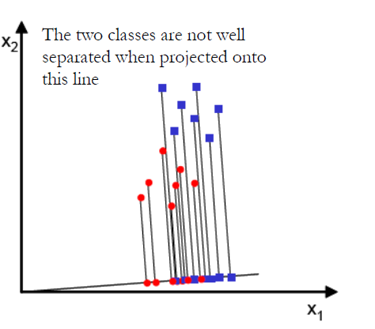
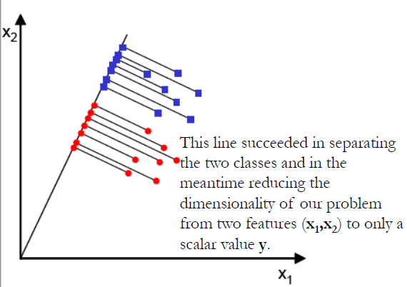

```{r, setup, include=FALSE}
knitr::opts_knit$set(root.dir = 'C:/Users/neide/Documents/GitHub/ma189/Data')
```

## Linear Discriminant Analysis: Procedure

- We are given a training dataset which contains $g$ populations. Suppose we have a new
observation $\underline{x}$ that is to be classified into one of the $g$ populations.
- We can apply linear discriminant analysis as follows:

1. Choose priors $p_k$ for $k=1,2,\ldots, g$.
2. Calculate sample mean vectors $\overline{\underline{x}}_k$ for $k=1,2,\ldots, g$.
3. Calculate pooled sample covariance matrix
\[
 {\mathbf S}  =  \frac{1}{N-g} \sum_{k=1}^g \sum_{i=1}^{n_k} 
 {   \left( \underline{x}_i^{(k)} - 
\overline{\underline{x}}^{(k)} \right)   } 
{  \left( \underline{x}_i^{(k)} - \overline{\underline{x}}^{(k)} \right)  }^{\prime},
\]
4. Calculate coefficients
\[
  \widehat{\alpha}_k  =  - \frac{1}{2}  {  \overline{\underline{x}}^{(k)}}^{\prime} \,
   {\mathbf S}^{-1} { \overline{\underline{x}}^{(k)} } + \log p_k
\]
5. Calculate coefficients
\[
  \widehat{\underline{\beta}}_k  =    {\mathbf S}^{-1} \, 
   {  \overline{\underline{x}}^{(k)} }^{\prime}
\]
6. Calculate
\[
 \widehat{d}_k^L (\underline{x})  = \widehat{\alpha}_k + \widehat{\underline{\beta}}_k^{\prime} \underline{x}
\]
for $k=1,2,\ldots, g$.
7. Classify $\underline{x}$ into the group with highest value of $\widehat{d}_k^L (\underline{x})$.

## Example: LAD on Iris Dataset

1. Divide the iris dataset into a training data of 120 observations (40 from each species) and a prediction data of 30 observations (10 from each species). For the prediction set, we pretend that we do not know the true species.
2. Choose the prior for each species according to the relative sample size in the training data:
\[
 p_1 = p_2 = p_3 = \frac{40}{120} = \frac{1}{3}.
\]
3. Estimate the coefficients in the linear discriminant functions using the training data.
4. Calculate the linear discriminant functions for each observation in the prediction data.
5. Classify each observation in the prediction dataset to the species with highest linear discriminant function value.
6. Compare the estimated species labels with the truth.

```{r}
iris <- read.csv("iris.csv")
iris$X <- NULL
iris.setosa <- iris[iris$Species == "setosa",]
iris.versi <- iris[iris$Species == "versicolor",]
iris.virgi <- iris[iris$Species == "virginica",]

iris.train <- rbind(iris.setosa[1:40,],iris.versi[1:40,],iris.virgi[1:40,])
iris.test <- rbind(iris.setosa[41:50,],iris.versi[41:50,],iris.virgi[41:50,])
n_setosa <- 40
n_versicolor <- 40
n_virginica <- 40

#Prior: relative sample size in train data
p_setosa <- n_setosa/120
p_versicolor <- n_versicolor/120
p_virginica <- n_virginica/120
```

### Iris Sample Mean Vectors

```{r}
Mean_setosa <- colMeans(iris.train[iris.train$Species == "setosa",1:4])
Mean_versicolor <- colMeans(iris.train[iris.train$Species == "versicolor",1:4])
Mean_virginica <- colMeans(iris.train[iris.train$Species == "virginica",1:4])
rbind(Mean_setosa,Mean_versicolor,Mean_virginica)
```

### Iris Pooled Sample Covariance

```{r}
S_setosa <- cov(iris.train[iris.train$Species == "setosa",1:4])
S_versicolor <- cov(iris.train[iris.train$Species == "versicolor",1:4])
S_virginica <- cov(iris.train[iris.train$Species == "virginica",1:4])
S_pooled <- ((n_setosa-1)*S_setosa +(n_versicolor-1)*S_versicolor+
               (n_virginica-1)*S_virginica)/(n_setosa+n_versicolor+n_virginica-3)
S_pooled
```

### Intercepts of Linear Discriminant Function 
 
```{r}
S_inv <- solve(S_pooled)
alpha_setosa <- -0.5* t(Mean_setosa) %*% S_inv %*% Mean_setosa
alpha_versicolor <- -0.5* t(Mean_versicolor) %*% S_inv %*% Mean_versicolor
alpha_virginica <- -0.5* t(Mean_virginica) %*% S_inv %*% Mean_virginica
alpha_iris <- c(alpha_setosa,alpha_versicolor,alpha_virginica)
alpha_iris
```

### Slope Coefficients of Linear Discriminant Function 

```{r}
beta_setosa <- S_inv %*% Mean_setosa
beta_versicolor <- S_inv %*% Mean_versicolor
beta_virginica <- S_inv %*% Mean_virginica
beta_iris <- cbind(beta_setosa,beta_versicolor,beta_virginica)
beta_iris
```

### Example: LDA on Iris Dataset 

- We calculate the LD function values for each observation in the test dataset. The results are presented in the following 3D scatter plot.

```{r}
prediction <- c()
d_setosa_vec <- c()
d_versicolor_vec <- c()
d_virginica_vec <- c()
label <- c("setosa", "versicolor", "virginica")

for(i in 1:nrow(iris.test)){
    #Read an ovservation in test data
    x <- t(iris.test[i,1:4])
    
    #Calculate linear discriminant functions for each 
    d_setosa <- alpha_setosa + t(beta_setosa) %*% x
    d_versicolor <- alpha_versicolor + t(beta_versicolor) %*% x
    d_virginica <- alpha_virginica + t(beta_virginica) %*% x

    #Classify the observation to the class with highest function value
    d_vec <- c(d_setosa, d_versicolor, d_virginica)
    prediction <- append(prediction, label[which.max( d_vec )])
    
    d_setosa_vec <- append(d_setosa_vec, d_setosa)
    d_versicolor_vec <- append(d_versicolor_vec, d_versicolor)
    d_virginica_vec <- append(d_virginica_vec, d_virginica)
}

#Combine the predicted results to the test dataset.
iris.test$prediction <- prediction

#3D scatter plot
library("scatterplot3d")
col_vec <- c(rep("red", 10), rep("blue", 10), rep("black", 10))
pch_vec <- c(rep(15, 10), rep(17, 10), rep(19, 10))

scatterplot3d(x = d_setosa_vec, y = d_versicolor_vec, z = d_virginica_vec,
              xlab = "d_setosa", ylab = "d_versicolor",	zlab="d_virginica", 
              color="red", pch=19, angle = 55 , cex.symbols=2, cex.lab=2)
scatterplot3d(x = d_setosa_vec, y = d_versicolor_vec, z = d_virginica_vec,
              xlab = "d_setosa", ylab = "d_versicolor",	zlab="d_virginica", 
              color=col_vec, pch=pch_vec, angle = 55 , cex.symbols=2, cex.lab=2)
```


- The classification results versus truth are given in the following table.

```{r}
setosa_true <- sum((iris.test$Species == "setosa") & (iris.test$prediction == "setosa"))
versicolor_true <- sum((iris.test$Species == "versicolor") & (iris.test$prediction == "versicolor"))
virginica_true <- sum((iris.test$Species == "virginica") & (iris.test$prediction == "virginica"))
class_tab <- c(n_setosa,n_versicolor,n_virginica)
class_tab <- rbind(class_tab,
       c(setosa_true,versicolor_true,virginica_true))
class_tab <- rbind(class_tab,class_tab[1,] - class_tab[2,])
colnames(class_tab) <- c("setosa","versicolor","virginica")
rownames(class_tab) <- c("Number Observations","Number Correct","Number Wrong")
class_tab
```

- **Outstanding!**
- But:

1. Large training set, small test set.
2. Near *oracle* prior. ("Oracle" means you already knew what the answer was.)
3. The partition of training and test data was non-random and balanced.

## A Binary Classification Example: Why Does LDA Work?

- Suppose there are only two groups in the training data, i.e., $k = 1,2$.
- Classifying an observation $\underline{x}$ into the first group is equivalent to
\[
  d^L_1 (\underline{x}) - d^L_2 (\underline{x}) > 0
\]
- Note that this difference can also be written as a linear function of $\underline{x}$.

\[
  d^L_1 (\underline{x}) - d^L_2 (\underline{x}) =
  - \frac{1}{2} \underline{\mu}_1^{\prime} {\mathbf \Sigma}^{-1} \underline{\mu}_1
 + \frac{1}{2} \underline{\mu}_2^{\prime} {\mathbf \Sigma}^{-1} \underline{\mu}_2
 + \log (p_1 /p_2) + 
  {( \underline{\mu}_1 - \underline{\mu}_2 )}^{\prime} {\mathbf \Sigma}^{-1} \underline{x}.
\]

- Letting $\frac{1}{2} \left( \underline{\mu}_1^{\prime} {\mathbf \Sigma}^{-1} \underline{\mu}_1  - \underline{\mu}_2^{\prime} {\mathbf \Sigma}^{-1} \underline{\mu}_2 \right) - \log (p_1 /p_2)$ and $\underline{\omega} = {\mathbf \Sigma}^{-1} {( \underline{\mu}_1 - \underline{\mu}_2 )}$,
 the inequality above says that
\[
 \underline{\omega}^{\prime} \underline{x} > c.
\]

- For given training data, we can estimate $\underline{\omega}$ and $c$ by $\widehat{\underline{\omega}}$ and $\widehat{c}$.
- The classification rule for an observation $\underline{x}$ becomes

1. Classify $\underline{x}$ to group 1 if $\underline{\omega}^{\prime} \underline{x} > c$.
2. Classify $\underline{x}$ to group 2 if $\underline{\omega}^{\prime} \underline{x} < c$.

- The vector $\underline{\omega} = {\mathbf \Sigma}^{-1} {( \underline{\mu}_1 - \underline{\mu}_2 )}$ is a "direction” that makes the two groups (populations) most separable.

### Geometry

- Suppose the covariates are independent, i.e. ${\mathbf \Sigma}$ is an identity matrix.
- Then $\underline{\omega}$ is in the same direction as ${( \underline{\mu}_1 - \underline{\mu}_2 )}$
- Then $\underline{\omega}^{\prime} \underline{x} = \| \underline{\omega} \| \| \underline{x} \| \cos (\theta)$, where $\theta$ is the angle between $\underline{\omega}$ and $\underline{x}$.
- The absolute value of this dot product is maximized when $\theta = 0, \pi$, i.e., when $\underline{x}$ and ${( \underline{\mu}_1 - \underline{\mu}_2 )}$ are pointed in the same "direction.”

### Geometric Illustration

Suppose we have two 2-dimensional populations. Dots are either blue or red, denoting which population a sample comes from.
- Consider projecting the samples onto different lines, which represent the vector $\underline{\omega}$
- First project onto a line close to x-axis: the points of the two samples are clustered together.




- Second, project on a line that increases rapidly; now the projected samples are separated!



- LDA "chooses" the direction that separates the two populations most: $\underline{\omega} = {\mathbf \Sigma}^{-1} {( \underline{\mu}_1 - \underline{\mu}_2 )}$ is that direction.
