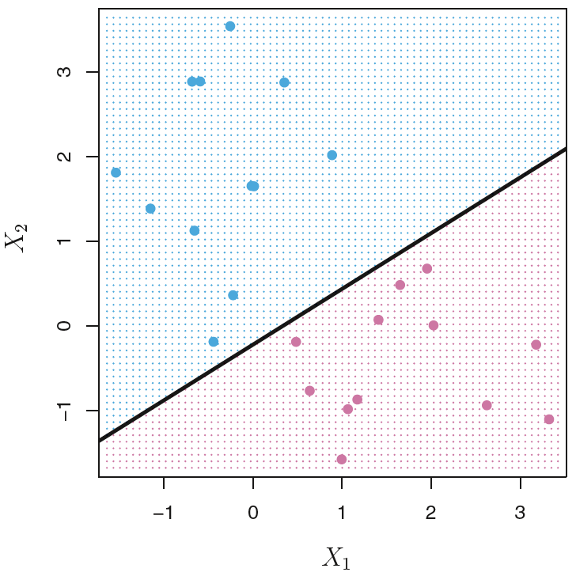
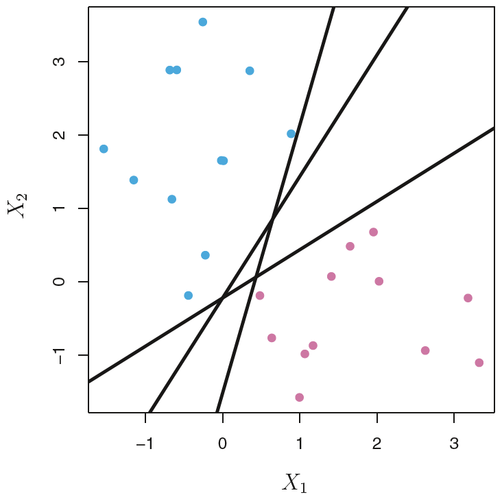
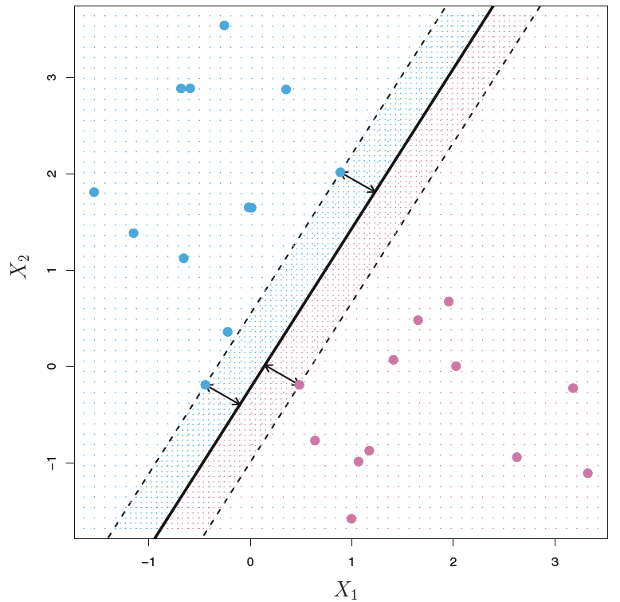
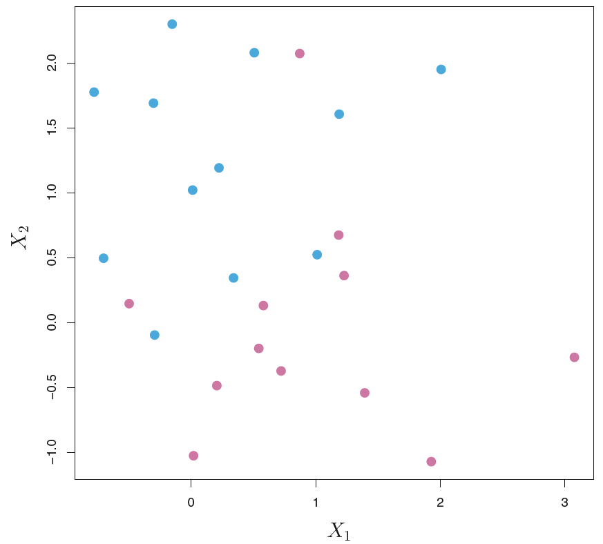
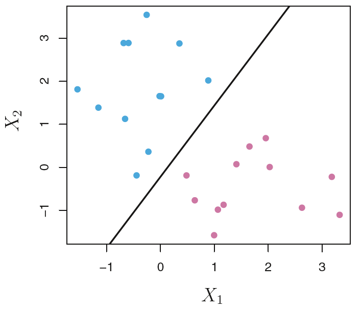
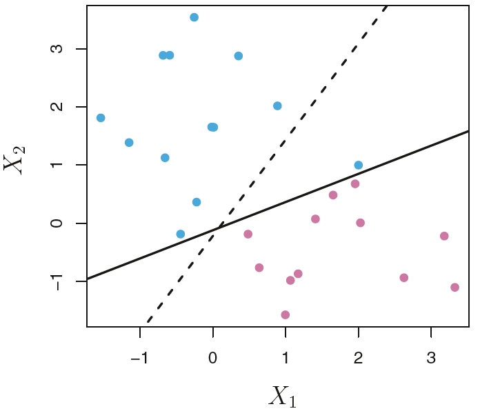
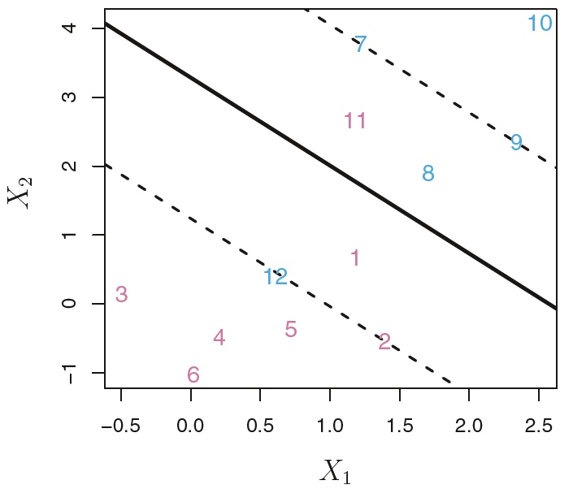
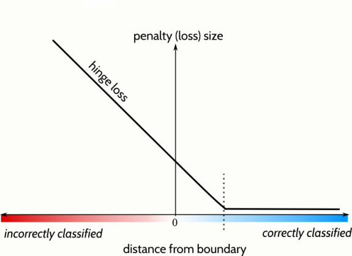

```{r, setup, include=FALSE}
knitr::opts_knit$set(root.dir = 'C:/Users/neide/Documents/GitHub/ma189/Data')
```

# Discrimination

- We have already examined Fisher’s Linear Discriminant Analysis (LDA) and logistic regression method for classification.
- Now we study *support vector machine* for classification:

1. Separating hyperplane
2. Maximal margin classifier
3. Support vector classifier

# Support Vector Machine

- Support vector machine (SVM) is a classification method developed in the computer science community in 1990s, and has grown in popularity since then.
- Support vector machines have been shown to perform well in a variety of settings, and are
often considered one of the best "out of the box” classifiers.
- Support vector machines are intended for the binary classification setting in which there
are two classes. There are extensions of SVM to the case of more than two classes. SVM can also be extended to regression tasks.
- SVM is a generalization of a simple and intuitive classifier, called the *maximal margin
classifier*.

# Hyperplane

- In a $p$-dimensional space, a hyperplane is a flat affine subspace of dimension $p-1$. The
word affine indicates that the subspace needs not pass through the origin.
- For instance, in two dimensions, a hyperplane is a straight line. In three dimensions, a
hyperplane is a plane.
- The mathematical definition of a hyperplane is quite simple. A hyperplane in $p$-dimensional space is
\[
 \{ \underline{X} \in {\mathbb R}^p :    \beta_0 + \beta_1 X_1 + \ldots + \beta_p X_p = 0 \}
\]
- For a $p$-vector $\underline{X}$, we say $\underline{X}$ lies on the hyperplane if $\underline{X}$ satisfies the above equation.
- A $p-1$-dimensional hyperplane cuts a $p$-dimensional space into two "sides”.
- For a $p$-vector $\underline{X}$ that does not lie on the hyperplane, it either lies on the positive side or the negative side of the hyperplane.  
- The positive side:
\[
 \beta_0 + \beta_1 X_1 + \ldots + \beta_p X_p > 0
\]
- The negative side:
\[
 \beta_0 + \beta_1 X_1 + \ldots + \beta_p X_p < 0
\]
- For a given point $\underline{X}$, one can easily determine on which side of thehyperplane it lies by calculating the sign of $\beta_0 + \beta_1 X_1 + \ldots + \beta_p X_p$.

## Example: Hyperplane in ${\mathbb R}^2$

- Here we draw a hyperplane
\[
  1 + 2 X_1 + 3 X_2 = 0
\]
in ${\mathbb R}^2$, displayed using a black solid line.
- The blue region is the set of points for which
\[
  1 + 2 X_1 + 3 X_2 > 0
\]
- The purple region is the set of points for which
\[
  1 + 2 X_1 + 3 X_2 < 0
\]
- For a given point $\underline{X} = {[ X_1, X_2 ]}^{\prime}$, we can
decide its region by calculating the sign of
\[
  1 + 2 X_1 + 3 X_2 
\]

```{r}
x1 <- seq(-1.5,1.5,.1)
x2 <- seq(-1.5,1.5,.1)
y <- -(1/3) + (-2/3)*x1 
plot(x1,y,type="l",xlim=c(-1.5,1.5),ylim=c(-1.5,1.5),lwd=3)
for(i in 1:length(x1))
{
  for(j in 1:length(x2))
  {
    if(1+2*x1[i]+3*x2[j] < 0) { points(x1[i],x2[j],col=6,pch=20)}
    if(1+2*x1[i]+3*x2[j] > 0) { points(x1[i],x2[j],col=4,pch=20)}
  }
}
```

## Some Hyperplane Geometry

- We can describe the hyperplane $H$ as
\[
 H = \{ \underline{X} \in {\mathbb R}^p : \underline{\beta}^{\prime} \underline{X} = - \beta_0
   \}.
\]
- Since we can always divide through by the length $\| \underline{\beta} \|$ and redefine $\beta_0$, let us assume that $\| \underline{\beta} \| = 1$.
- If $\beta_0 = 0$, we can visualize $H$ as being perpendicular to the vector $\underline{\beta}$.
- Given any $\underline{Z} \in {\mathbb R}^p$, what is its distance to $H$? The distance from a set to a point is given by *orthogonal projection*: find $P_H ( \underline{Z}) \in H$ such that $Z - P_H ( \underline{Z})$ is perpendicular (orthogonal) to $H$.
- The orthogonal projection is
\[
 P_H ( \underline{Z}) = \underline{Z} - 
 \left(  \underline{Z}^{\prime} \underline{\beta} + \beta_0 \right) \, \underline{\beta}.
\]
Because $\underline{Z} - P_H (\underline{Z})$ is a multiple of $\underline{\beta}$, this gap is orthogonal to $H$.
- Then the distance from $\underline{Z}$ to $H$ is 
\[
  |  \underline{Z}^{\prime} \underline{\beta} + \beta_0 |.
\]

## Classification Using a Hyperplane

- Suppose that we have a $n \times p$ data matrix ${\mathbf X}$ that consists of $n$ training
observations in $p$-dimensional space,
\[
 \left[ \begin{array}{c} x_{11} \\ x_{12} \\ \vdots \\ x_{1p} \end{array} \right], \;
 \left[ \begin{array}{c} x_{21} \\ x_{22} \\ \vdots \\ x_{2p} \end{array} \right], \ldots
 \left[ \begin{array}{c} x_{n1} \\ x_{n2} \\ \vdots \\ x_{np} \end{array} \right].
\]
and assume these observations fall into two classes, i.e., 
$y_1, y_2, \ldots, y_n \in \{ -1, 1 \}$.
- The property of hyperplane that divides the space motivates us to consider if it is possible to construct a hyperplane that separates the training observations perfectly according to their class labels.

## Separating Hyperplane

- The separating hyperplane that can perfectly classify the observations by their class labels
must satisfy
\[
 \beta_0 + \beta_1 x_{i1} + \ldots + \beta_p x_{ip} > 0 
\]
 if $y_i = 1$, and
\[
 \beta_0 + \beta_1 x_{i1} + \ldots + \beta_p x_{ip} < 0 
\]
 if $y_i = -1$. 
- Equivalently, a separating hyperplane has the property that
\[
 y_i (\beta_0 + \beta_1 x_{i1} + \ldots + \beta_p x_{ip}) > 0. 
\]
for all $i = 1, \ldots, n$.
- If a separating hyperplane exists, we can use it to construct a very natural classifier: a test observation is assigned to a class depending on which side of the hyperplane it is located.
- That is, we classify the test observation $x^*$ based on the sign of
\[
 \beta_0 + \beta_1 x_{1}^* + \ldots + \beta_p x_{p}^*
\]

### Example: Separating Hyperplane

- Here we draw an example of a separating hyperplane in two dimensions.
- We color the observations with label $y_i =1$  as blue and the observations with label $y_i -1$ as purple.
- The black solid line shows a hyperplane that perfectly separates two classes.
- For a new observation $x^*$, we will predict $y^* = 1$ if $x^*$ falls into the blue region, and predict $y^* = -1$ if $x^*$ falls into the purple region.


 
 
### Issue of Separating Hyperplane

- If the data can be perfectly separated using a hyperplane, then there will in fact exist an
infinite number of such hyperplanes.
- This is because a given separating hyperplane can usually be shifted a tiny bit up or down, or rotated, without coming into contact with any of the observations.
- Three possible separating hyperplanes are shown in the figure.
- In order to construct a classifier based upon a separating hyperplane, we must have a
reasonable way to decide which one of the infinitely many legitimate separating
hyperplanes to use.


 
## Maximal Margin Classifier

- A natural choice is the *maximal margin* hyperplane (also known as the optimal separating
hyperplane), which is the separating hyperplane that is farthest from the training observations.
- That is, we can compute the (perpendicular) distance from each training observation to a
given separating hyperplane; the smallest such distance is the minimal distance from the
observations to the hyperplane, which is known as the *margin*.
- The maximal margin hyperplane is the separating hyperplane for which the margin is largest, i.e., it is the hyperplane that has the largest minimum distance to the training observations.
- This is known as the maximal margin classifier. We can then classify a test observation
based on which side of the maximal margin hyperplane it falls. 
 
### Example: Maximal Margin Classifier

- Here we draw the maximal margin hyperplane on this dataset. In a sense, the maximal margin
hyperplane represents the mid-line of the widest "slab” that we can insert between the two classes.
- We see that three training observations are equidistant from the maximal margin
hyperplane and lie along the dashed lines indicating the width of the margin.
- These three observations are known as *support vectors*, since they "support” the maximal
margin hyperplane in the sense that if these points were moved slightly then the maximal
margin hyperplane would move as well.
 
 

 
 
## Construction of Maximal Margin Classifier

- We now consider the task of constructing the maximal margin hyperplane based on a set of $n$ training observations $\underline{x}_1, \ldots, \underline{x}_n \in {\mathbf R}^p$, and associated class labels $y_1, \ldots, y_n \in \{-1,1\}$.
- Briefly, the maximal margin hyperplane is the solution to this optimization problem:
\begin{align*}
 & \mbox{maximize}_{ \beta_0, \beta_1, \ldots, \beta_p} \, M \\
 &  \mbox{such that} \; \sum_{j=1}^p \beta_j^2 = 1 \\
 &  \mbox{and} \;  y_i (\beta_0 + \beta_1 x_{i1} + \ldots + \beta_p x_{ip})  > M
 \quad \mbox{for all} \; 1 \leq i \leq n.
\end{align*}
This means to find values $\beta_0, \beta_1, \ldots, \beta_p$ and $M$ such that $M$ is as large as possible, subject to the two conditions.
- This optimization problem is actually simpler than it looks.

1. The second condition guarantees that each observation will be on the correct side of the hyperplane when $M$ is positive.
2. The first condition says that $\underline{\beta}$ has length one, and hence
\[
 y_i (\beta_0 + \beta_1 x_{i1} + \ldots + \beta_p x_{ip})
 \]
 can be interpreted as the perpendicular distance from $\underline{x}_i$ to the hyperplane. 
 
### Non-separable Case

- The maximal margin classifier is a very natural way to perform classification, if a
separating hyperplane exists.
- However, for more complex data no separating hyperplane exists, and so there is
no maximal margin classifier.
- In such cases, the optimization problem above has no solution with $M > 0$.
- Example: we cannot exactly separate the two classes using a line.
- Hyperplane separation theorem: take convex hull of data points for two groups. If they are disjoint, then a separating hyperplane exists.



## Issues with Maximal Margin Classifier

- Even if a separating hyperplane does exist, there are also scenarios in which a
maximal margin classifier may not be desirable.
- Classification based on a separating hyperplane that perfectly classifies all
training observations can lead to sensitivity to individual observations. *Overfitting*
- Consider the maximal margin classifier as shown below. Suppose that we add one single observation to the training set.




- The addition of a single observation leads to a dramatic change in the separating
hyperplane (see the change from dashed line to solid one).



- The resulting maximal margin hyperplane is not satisfactory

1. It has only a tiny margin.
2. It is extremely sensitive to a change in a single observation.

- For better classification of most of the training observations, we may consider a
classifier based on a hyperplane that does not perfectly separate the two classes.
 
 
## Support Vector Classifier

- We extend the concept of a separating hyperplane in order to develop a hyperplane that
almost separates the two classes, using a so-called *soft margin*.
- The idea is as follows: rather than seeking the largest possible margin so that every
observation is not only on the correct side of the hyperplane but also on the correct side of
the margin, we instead allow some observations to be on the incorrect side of the margin,
or even the incorrect side of the hyperplane.
- The margin is soft because it can be violated by some of the training observations. In fact,
when the data is non-separating, such a situation is inevitable.
- This generalization of the maximal margin classifier to the non-separable case is known as
the *support vector classifier*. 

### Example: Support Vector Classifier

- Suppose we fit a support vector classifier on a small toy dataset. The hyperplane is shown as a solid line and the margins are shown as dashed lines.
- Purple observations 3,4,5,6 and blue observation 10 are on the correct sides of
hyperplane and margins.
- Purple observations 1, 2 and blue observations 7,8,9 are on the wrong sides of
margins.
- Purple observation 11 and blue observation 12 are on the wrong sides of hyperplane.



## Construction of Support Vector Classifier

- The support vector classifier finds the hyperplane that separates most of the training
observations, but may misclassify a few of them. It is the solution of the problem:
\begin{align*}
 & \mbox{maximize}_{ \beta_0, \beta_1, \ldots, \beta_p, \epsilon_1, \ldots, \epsilon_n}
  \, M \\
 &  \mbox{such that} \; \sum_{j=1}^p \beta_j^2 = 1 \\
 &  \mbox{and} \;  y_i (\beta_0 + \beta_1 x_{i1} + \ldots + \beta_p x_{ip}) > M (1 - \epsilon_i)
 \quad \mbox{for all} \; 1 \leq i \leq n  \\
 & \epsilon_i > 0, \sum_{i=1}^n \epsilon_i \leq C,
\end{align*}
where $C \geq 0$ is a tuning parameter and $M$ denotes the width of the margin.
- The quantities $\epsilon_1, \ldots, \epsilon_n$ are called *slack variables* that allow individual observations to be on the wrong side of the margin or the hyperplane.
- The *maximal margin classifier* is a special case of *support vector classifier* with
\[
 \epsilon_1 = \ldots = \epsilon_n = 0 \qquad \mbox{or} \qquad C = 0.
\]

## Support Vectors

- The optimization problem of support vector classifier has a very interesting property: it
turns out that only observations that either lie on the margin or that violate the margin will
affect the hyperplane, and hence the classifier obtained.
- Observations that lie directly on the margin, or on the wrong side of the margin for their
class, are known as support vectors.
- The fact that the support vector classifier’s decision rule is based only on a potentially
small subset of the training observations (the support vectors) means that it is quite robust
to the behavior of observations that are far away from the hyperplane.
- This property is distinct from some of the other classification methods that we have
discussed, such as linear discriminant analysis (LDA).

## Slack Variables

- The slack variable $\epsilon_i$ tells us where the $i$th observation is located, relative to the hyperplane and relative to the margin.

1. If $\epsilon_i=0$ then the $i$th observation is on the correct side of hyperplane and margin.
2. If $\epsilon_i > 0$ then the $i$th observation is on the wrong side of margin.
3. If $\epsilon_i > 1$ then the $i$th observation is on the wrong side of hyperplane.

- The tuning parameter $C$ controls the sum of $\epsilon_i$s, and hence it determines the
number and degree of the violations to the margin and hyperplane that we can tolerate.
- We can think of $C$ as a budget for the amount that the margin can be violated by the $n$ observations. For $C > 0$, no more than $C$ observations can be on the wrong side of the hyperplane.

## Bias-Variance Trade-off

- Similarly to the tuning parameters that we have seen throughout this course, the
"violation budget” $C$ controls the bias-variance trade-off of the support vector
classifier.
- When $C$ is small, we seek narrow margins that are rarely violated; this amounts to a classifier that is highly fit to the data, which may have low bias but high variance.
- On the other hand, when $C$ is larger, the margin is wider and we allow more violations to it; this amounts to fitting the data less hard and obtaining a classifier that is potentially more biased but may have lower variance.
- In practice, we can choose $C$ though *Cross-Validation* like other tuning parameters.

### Example: Bias-Variance Trade-off

- A support vector classifier was fit using four different values of the tuning parameter $C$. The value of $C$ decreases from top left to bottom right.
- The value of $C$ can be visualized by the width of margins (i.e., gap between dashed lines).
- When $C$ is large, there is a high tolerance for observations being on the wrong side
of the margin, and so the margin will be large.
- As $C$ decreases, the tolerance for observations being on the wrong side of the margin decreases, and the margin narrows down.


## Construction of Support Vector Classifier

- The optimization problem that leads to the support vector classifier can be re-written in a
"Loss plus Penalty” form:
\begin{align*}
  & \mbox{minimize}_{ \beta_0, \beta_1, \ldots, \beta_p}
  \{ L ( {\mathbf X}, \underline{y}, \underline{\beta}, \beta_0) +
   \lambda P (\underline{\beta}) \} \\
     = & \mbox{minimize}_{ \beta_0, \beta_1, \ldots, \beta_p}
     \{ \sum_{i=1}^n \mbox{max} [0, 
     1 - y_i ( \beta_0 + \underline{\beta}^{\prime} \underline{x}_i )]
     + \lambda \sum_{i=1}^p \beta_i^2 \},
\end{align*}     
where $\lambda \geq 0$ is a tuning parameter. The penalty term  $P (\underline{\beta}) = \sum_{i=1}^p \beta_i^2$ is called the $L_2$-penalty.
- This form gives us a better understanding of the bias-variance trade-off:

1. If $\lambda$ is large then $\beta_1, \ldots, \beta_p$ will tend to be smaller, and thus more violations to the margin are tolerated, and a low-variance but high-bias classifier will result.
2. When $\lambda$ is small then few violations to the margin will occur; this amounts to a high-variance but low-bias classifier.
3. Thus, a small value of $\lambda$ amounts to a small value of $C$.

## Hinge Loss

- The loss function for the support vector classifier admits the form
\[
L_n (\underline{\beta}) = \sum_{i=1}^n \mbox{max} [0, 
     1 - y_i ( \beta_0 + \underline{\beta}^{\prime} \underline{x}_i )].
\]
This is known as *hinge loss*.
- The hinge loss is a piece-wise linear function which equals to 0 when
\[
  y_i ( \beta_0 + \underline{\beta}^{\prime} \underline{x}_i ) \geq 1.
\]
- The property of hinge loss shows us the reason that only support vectors play a role in the classifier obtained. The observations on the correct side of the margin do not affect it, as they satisfy the above inequality.


