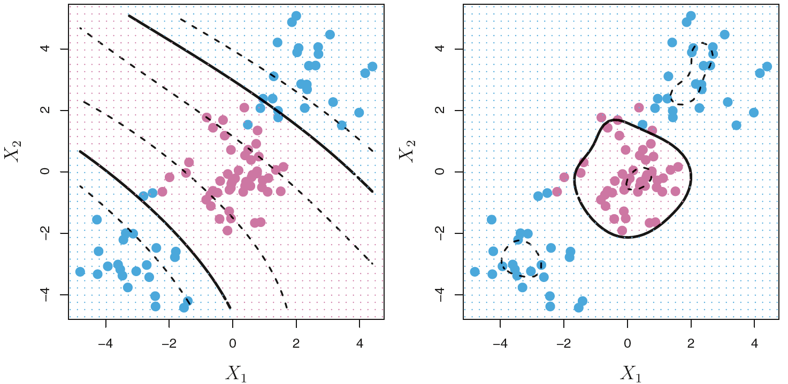
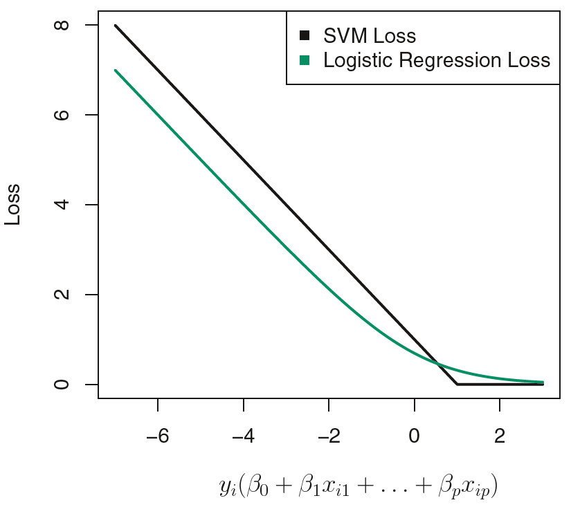
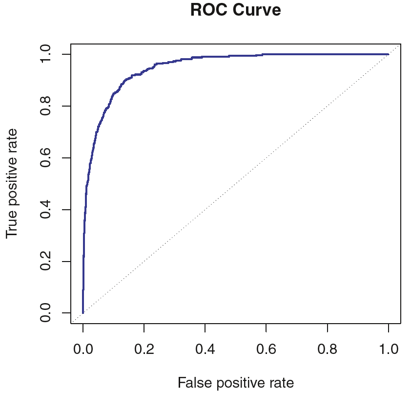

```{r, setup, include=FALSE}
knitr::opts_knit$set(root.dir = 'C:/Users/neide/Documents/GitHub/ma189/Data')
```


# Classification with Nonlinear Boundaries

- The support vector classifier is a natural approach for binary classification if the boundary between the two classes is linear (i.e., we can use a hyperplane). However, in practice we are sometimes faced with nonlinear class boundaries.

## Review of Nonlinear Regression

- Recall (hopefully!) that in multivariate linear regression, we faced a similar problem when the linearity assumption is violated.
- In that case, we consider enlarging the feature space using functions of the predictors,
such as quadratic and cubic terms, in order to address this non-linearity.
- In the case of the support vector classifier, we can address the problem with possibly nonlinear boundaries between classes in a similar way, by enlarging the feature space using
quadratic, cubic, and even higher-order polynomial functions of the predictors.
- For instance, rather than fitting a support vector classifier using $p$ features $X_1, \ldots, X_p$, we could instead fit a support vector classifier using $2p$ features
\[
 X_1, X_1^2, X_2, X_2^2, \ldots, X_p, X_p^2.
\]
 
## Construction of Nonlinear Support Vector Classifier

- With $2p$ quadratic features $X_1, X_1^2, X_2, X_2^2, \ldots, X_p, X_p^2$, the nonlinear support vector classifier is the solution of the following problem:
\begin{align*}
 & \mbox{maximize}_{ \beta_0, \beta_{11}, \beta_{12}, \ldots, \beta_{p1}, \beta_{p2}, \epsilon_1, \ldots, \epsilon_n}
  \, M \\
 &  \mbox{such that} \; \sum_{j=1}^p \sum_{k=1}^2 \beta_{jk}^2 = 1 \\
 &  \mbox{and} \;  y_i (\beta_0 + \sum_{j=1}^n \beta_{j1}  x_{ij}
  + \sum_{j=1}^n \beta_{j2}  x_{ij}^2 ) > M (1 - \epsilon_i)
 \quad \mbox{for all} \; 1 \leq i \leq n  \\
 & \epsilon_i > 0, \sum_{i=1}^n \epsilon_i \leq C.
\end{align*}
- In the enlarged feature space, the decision boundary of the above optimization problem is
in fact linear.
- But in the original feature space, the decision boundary is of the form $q(x) = 0$, where $q$ is a quadratic polynomial, and the solutions are generally nonlinear.

## Discussions on Nonlinear Support Vector Classifier

- One might additionally want to enlarge the feature space with higher-order polynomial terms, or with interaction terms of the form $X_j X_k$ for $j \neq k$.
- Alternatively, other functions of the predictors could be considered rather than polynomials.
- There are many possible ways to enlarge the feature space; so unless we are careful, we could end up with a huge number of features. Computations would then become unmanageable.
- The support vector machine allows us to enlarge the feature space used by the support vector classifier in a way that leads to efficient computations.

## Solution of Support Vector Classifier

- We have not discussed exactly how the support vector classifier is computed because the
details become somewhat technical. However, it turns out that the solution to the support
vector classifier involves only the inner products of the observations.
- It can be shown that, the linear support vector classifier can be represented as
\[
  f( \underline{x}) = \beta_0 + \sum_{i=1}^n \alpha_i y_i \langle \underline{x}, \underline{x}_i \rangle,
\]
where  $\langle \underline{x}, \underline{x}_i \rangle = \sum_{j=1}^p x_j x_{ij}$ is the inner product between $\underline{x}$ and $\underline{x}_i$. There are $n$ parameters $\alpha_1, \ldots, \alpha_n$, one per training observation.
- To estimate the parameters $\alpha_i$s and $\beta_0$, we need the inner products $\langle \underline{x}_i, \underline{x}_k \rangle$ for $i \neq k$.  There are $\binom{n}{2} = n (n-1)/2$ such pairs.
- In order to evaluate the function $f( \underline{x})$, we need to compute the inner product between the $\underline{x}$ and each $\underline{x}_i$ of the training points.
- However, it turns out that $\alpha_i$ is nonzero only for the support vectors in the solution. So if $S$ is the collection of indices of support vectors, we can rewrite the above expression as
\[
  f( \underline{x}) = \beta_0 + \sum_{i \in S} \alpha_i y_i \langle \underline{x}, \underline{x}_i \rangle,
\]
which typically involves far fewer terms than $n$.
- To estimate the parameters $\alpha_i$s and $\beta_0$, we need the $\binom{S}{2}$ inner products $\langle \underline{x}_i, \underline{x}_k \rangle$ for $i \neq k \in S$.
- In summary, to construct a linear classifier $f( \underline{x})$ and compute its coefficients, all we need are inner products. 

## Support Vector Machine

- We can extend the support vector classifier to nonlinear decision boundaries by replacing the inner product with some nonlinear *kernel* functions:
\[
  \langle \underline{x}_i, \underline{x}_k \rangle \mapsto K ( \underline{x}_i, \underline{x}_k ).
\]
- This essentially amounts to fitting a support vector classifier in an enlarged feature space
with nonlinear features.
- When the support vector classifier is combined with a nonlinear kernel, the resulting
classifier is known as a *support vector machine* (SVM).
- SVM is an extension of the support vector classifier that results from enlarging the feature
space in a specific way, using kernels:
\[
  f( \underline{x}) = \beta_0 + \sum_{i=1}^n \alpha_i y_i  
   K ( \underline{x}, \underline{x}_i ).
\]

## Choice of Kernel Function

- Here are some popular choices of kernel functions:

1. Linear Kernel: $K ( \underline{x}_i, \underline{x}_k ) = \langle \underline{x}_i, \underline{x}_k \rangle$
2. Polynomial Kernel: $K ( \underline{x}_i, \underline{x}_k ) = {(1 + \langle \underline{x}_i, \underline{x}_k \rangle )}^d$ with $d \geq 2$.  
3. Gaussian Kernel: $K ( \underline{x}_i, \underline{x}_k ) = \exp \{ - \gamma { \| \underline{x}_i - \underline{x}_k \| }_2^2 \}$,   with $\gamma > 0$.

- Using a polynomial kernel amounts to fitting a support vector classifier in a higher-dimensional space involving polynomials of degree $d$.
- The Gaussian kernel gives weights to the training observations according to their Euclidean distance to the test observation. Hence, the Gaussian kernel has a local behavior, in the sense that only nearby training observations have an effect on the class label of a test observation. 

### Example: Support Vector Machine

- In this example, both polynomial and Gaussian kernels manage to capture the decision
boundary



 
 
## Kernel versus Enlarged Feature Space

- What is the advantage of using a kernel rather than simply enlarging the feature space using functions of the original features?

1. Computation: The dimensionality of enlarged feature space can be pretty high (e.g., a polynomial function of $p$). In contrast, a kernel expression of SVM is in general more parsimonious, as there are only $n+1$ parameters to estimate.
2. Tractability: The kernel approach only involves computing inner products over distinct pairs of observations. This can be done without explicitly specifying the enlarged feature space. In many applications of SVMs, the enlarged feature space can be complicated or even implicit.

- For some kernels, such as the Gaussian kernel, the feature space is implicit and infinite-dimensional, so we could never do the computations there anyway.

## SVMs with More Than Two Classes

- So far, our discussion has been limited to the case of binary classification: that is,
classification in the two-class setting.
- How can we extend SVMs to the more general case where we have some arbitrary number of classes?
- It turns out that the concept of separating hyperplanes upon which SVMs are based does not lend itself naturally to more than two classes.
- Though a number of proposals for extending SVMs to the $K$-class case have been made, the two most popular approaches are:

1. One-versus-one
2. One-versus-all

### One-Versus-One Classification

- Suppose we want to perform classification using SVMs, and there are $K > 2$ classes. A
one-versus-one or all-pairs approach constructs $\binom{K}{2}$ SVMs, each of which compares a pair of classes.
- For example, one such SVM might compare the $k$th class, coded as $+1$, to the $\ell$th class ($k \neq \ell$), coded as $-1$.
- We classify a test observation using each of the $\binom{K}{2}$ classifiers, and we tally the number of times that the test observation is assigned to each of the $K$ classes.
- The final classification is performed by assigning the test observation to the class to which it was most frequently assigned by these $\binom{K}{2}$ pairwise classifiers.
 
### One-Versus-All Classification

- The one-versus-all approach is an alternative procedure for applying SVMs in the case of $K > 2$ classes.
- We fit $K$ SVMs, each time comparing one of the $K$ classes to the remaining $K-1$ classes.
- Let $\beta_{0k}, \beta_{1k}, \ldots, \beta_{pk}$ denote the parameters that result from fitting an SVM comparing the $k$th class (coded as $+1$) to the others (coded as $-1$).
- Let $\underline{x}^*$ denote a test observation. We assign the observation to the class for which
\[
\beta_{0k} + \beta_{1k} x_1^* +  \ldots + \beta_{pk} x_p^* 
\]
 is  largest, for $k = 1, \ldots, K$. This amounts to a high level of confidence that the test observation belongs to the $k$th class rather than to any of the other classes. 
 
## Understanding SVM

- When SVMs were first introduced in the mid-1990s, they made quite a splash in the statistical and machine learning communities. This was due in part to their good performance, good marketing, and also to the fact that the underlying approach seemed both novel and mysterious.
- The idea of finding a hyperplane that separates the data as well as possible, while allowing
some violations to this separation, seemed distinctly different from classical approaches
for classification, such as logistic regression and linear discriminant analysis.
- Moreover, the idea of using a kernel to expand the feature space in order to accommodate
nonlinear class boundaries appeared to be a unique and valuable characteristic.
- For the past two decades, many efforts have been made to find deep connections between
SVMs and other more classical statistical methods. 

## Relationship to Logistic Regression

- The hinge loss function is closely related to the loss function used in logistic regression.
- Overall, the two loss functions have quite similar behavior. Hinge loss decays to exactly $0$ when $y_i ( \beta_0 + \underline{\beta}^{\prime} \underline{x}_i ) \geq 1$. In contrast, the loss function for logistic regression is close to but not exactly $0$.
- For SVM, only support vectors play a role in the classifier obtained. Due to the similarity
of the two losses, SVM and logistic regression often give very similar results.
- When the classes are well separated, SVMs tend to behave better than logistic regression; in more overlapping regimes, logistic regression is often preferred.




## ROC Curve

- The ROC curve is a popular graphical tool for comparing the performance of multiple classifiers. The name "ROC” is an acronym for *receiver operating characteristics*, which comes from communications theory.
- The ROC curve summarizes two types of error.

1. True positive rate (sensitivity): the fraction of observations in default class that are correctly identified. (This is like $\alpha$, the probability of Type I error.)
2. False positive rate (one minus specificity): the fraction of observations in non-default class that we classify incorrectly to default class.  (This is like power $1- \beta$, where $\beta$ is the probability of Type II error.)



- The ideal ROC curve hugs the top left corner, indicating a high true positive rate and a low false positive rate.
- The overall performance of a classifier is given by the area under the (ROC) curve (AUC). So the larger the AUC the better the classifier. 

## Example: Simulated Data

```{r}
# Generate a training dataset
set.seed(1)
x.train <- matrix(rnorm(200*2), ncol=2)
y.train <- c(rep(-1,100), rep (1 ,100))
x.train[y.train==1,] <- x.train[y.train==1,] + 1
data.train <- data.frame(x=x.train,y=as.factor(y.train))

# Scatter plot for trainig set
x <- x.train
y <- y.train
plot(x, col=(3-y))

# Generate a test sample
x.test <- matrix(rnorm(100*2), ncol =2)
y.test <- sample(c(-1,1), 100, rep=TRUE)
x.test[y.test ==1 ,] <- x.test[y.test ==1,] + 1
data.test <- data.frame(x=x.test, y=as.factor(y.test))
```

### Fit a Linear Support Vector Classifier

Library `e1071` contains the code to implement SVM. `svm` function will fit a support vector classifier. `kernel` option sets the kernel funciton for svm, linear kernel equals simple inner products. `cost` function sets the value for `C` which is the budget of violation.

```{r}
library(e1071)
svmfit.linear <- svm(y~.,data=data.train,kernel="linear",cost=10,scale=FALSE)

# Check the classifier
summary(svmfit.linear)
# Index of support vectors
svmfit.linear$index
# Plot the classifier on the training set
plot(svmfit.linear, data.train)

# Try a smaller cost function
svmfit.linear2 <- svm(y~.,data=data.train,kernel="linear",cost=0.1,scale=FALSE)
# Check the classifier
summary(svmfit.linear2)
# Index of support vectors
svmfit.linear2$index
# Plot the classifier on the training set
plot(svmfit.linear2, data.train)

# Choose cost C by cross-validation
tune.linear <- tune(svm,y~.,data=data.train,kernel="linear",
                    ranges=list(cost=c(0.001,0.01,0.1,1,5,10,100)))
# Check the selection resutls
summary(tune.linear)
# Choose the best model (classifier with optimal C)
bestmod.linear <- tune.linear$best.model
# Check the classifier
summary(bestmod.linear)
# Index of support vectors
bestmod.linear$index
# Plot the classifier on the training set
plot(bestmod.linear, data.train)


# Prediction on test set
ypred.linear <- predict(bestmod.linear,data.test)
# Check the prediction accuracy
table(predict=ypred.linear, truth=data.test$y)
test.error <- 1- mean(ypred.linear==data.test$y)
test.error
```
 
 
### Fit a Support Vector Classifier with Gaussian kernel

```{r}
# Set kernel="radial" and gamma=1 to fit Gaussian kernel SVM with tuning parameter 1
svmfit.gaussian <- svm(y~.,data=data.train,kernel="radial",gamma=1,cost=10)
summary(svmfit.gaussian)
plot(svmfit.gaussian,data.train)

# Choose cost C and gamma by cross-validation
tune.gaussian=tune(svm,y~.,data=data.train,kernel="radial",
                   ranges=list(cost=c(0.1,0.5,1,1.5,2,5),gamma=c(0.1,0.5,1,1.5,2)))
# Check the selection resutls
summary(tune.gaussian)
# Choose the best model (classifier with optimal C)
bestmod.gaussian <- tune.gaussian$best.model
# Check the classifier
summary(bestmod.gaussian)
# Index of support vectors
bestmod.gaussian$index
# Plot the classifier on the training set
plot(bestmod.gaussian,data.train)

# Prediction on test set
ypred.gaussian <- predict(bestmod.gaussian,data.test)
# Check the prediction accuracy
table(predict=ypred.gaussian, truth=data.test$y)
test.error <- c(test.error,1- mean(ypred.gaussian==data.test$y))
test.error # classification errors for linear SVM and Gaussian kernel SVM
```

### Fit a Support Vector Classifier  with Polynomial kernel


```{r}
# Set kernel="polynomial" and degree=3 to fit polynomial kernel SVM with degree 3
svmfit.poly <- svm(y~.,data=data.train,kernel="polynomial",degree=3,cost=10)
summary(svmfit.poly)
plot(svmfit.poly, data.train)

# Choose cost C and d by cross-validation
tune.poly <- tune(svm,y~.,data=data.train,kernel="polynomial",
                  ranges=list(cost=c(0.1,0.5,1,1.5,2 ,5),d=c(2,3,4,5)))
# Check the selection resutls
summary(tune.poly)
# Choose the best model (classifier with optimal C)
bestmod.poly <- tune.poly$best.model
# Check the classifier
summary(bestmod.poly)
# Index of support vectors
bestmod.poly$index
# Plot the classifier on the training set
plot(bestmod.poly,data.train)

# Prediction on test set
ypred.poly <- predict(bestmod.poly,data.test)
# Check the prediction accuracy
table(predict=ypred.poly,truth= data.test$y)
test.error <- c(test.error,1- mean(ypred.poly==data.test$y))
test.error # classification errors for linear SVM, Gaussian kernel SVM and Polynomial kernel SVM
```


### Plot ROC curve

`ROCR` package can be used to produce ROC curves. We first write a short function to plot an ROC curve given a vector containing a numerical score for each observation, pred, and a vector containing the class label for each observation, truth.


```{r}
library(ROCR)
rocplot <- function (pred, truth, ...){
    predob <- prediction(pred, truth)
    perf <- performance(predob, "tpr", "fpr")
    plot(perf,...)}


# Prepare the training and testing predictions for ROC curve
# optimal cost for linear kernel is C=0.5
summary(tune.linear)
linear.opt<-svm(y~., data.train, kernel="linear", cost=0.5, decision.values=TRUE)
linear.train<- attributes(predict(linear.opt, data.train, decision.values=TRUE))$decision.values
linear.test<- attributes(predict(linear.opt, data.test, decision.values=TRUE))$decision.values

# Prepare the training and testing predictions for ROC curve
# optimal cost for gaussian kernel is gamma=0.5, C=1
summary(tune.gaussian)
gaussian.opt<-svm(y~., data.train, kernel="radial", gamma=0.5, cost=1, decision.values=TRUE)
gaussian.train<-attributes(predict(gaussian.opt, data.train, decision.values=TRUE))$decision.values
gaussian.test<-attributes(predict(gaussian.opt, data.test, decision.values=TRUE))$decision.values

# Prepare the training and testing predictions for ROC curve
# optimal cost for gaussian kernel is gamma=0.5, C=1
summary(tune.gaussian)
gaussian.opt=svm(y~., data.train, kernel ="radial", gamma=0.5, cost=1, decision.values=TRUE)
gaussian.train=attributes(predict(gaussian.opt, data.train, decision.values=TRUE))$decision.values
gaussian.test=attributes(predict(gaussian.opt, data.test, decision.values=TRUE))$decision.values


# Prepare the training and testing predictions for ROC curve
# optimal cost for poly kernel is degree=3, C=1
summary(tune.poly)
poly.opt=svm(y~., data.train, kernel ="polynomial", degree=3, cost=1, decision.values=TRUE)
poly.train=attributes(predict(poly.opt, data.train, decision.values=TRUE))$decision.values
poly.test=attributes(predict(poly.opt, data.test, decision.values=TRUE))$decision.values


# Plot ROC curves for training set
#png(file = "ROC_training.png", width=640, height=480)
rocplot(-linear.train, data.train[,"y"], main="ROC for Training Set", col="red")
rocplot(-gaussian.train, data.train[,"y"], add=T, col="blue")
rocplot(-poly.train, data.train[,"y"], add=T, col="green")
legend("bottomright",legend=c("Linear","Gaussian","Polynomial"),col=c("red", "blue", "green"),lty=c(1,1,1),cex=1.5)
#dev.off()


# Plot ROC curves for testing set
#png(file ="ROC_testing.png", width=640, height=480)
rocplot(-linear.test, data.test[,"y"], main="ROC for Testing Set", col="red")
rocplot(-gaussian.test, data.test[,"y"], add=T, col="blue")
rocplot(-poly.test, data.test[,"y"], add=T, col="green")
legend("bottomright",legend=c("Linear","Gaussian","Polynomial"),col=c("red", "blue","green"),lty=c(1,1,1),cex=1.5)
#dev.off()
```
 
 
 
 