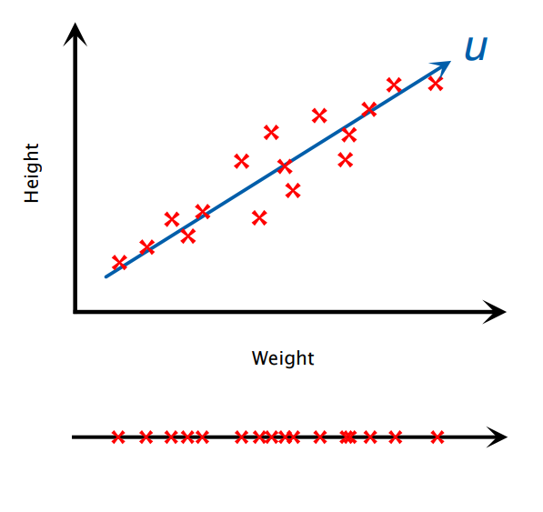
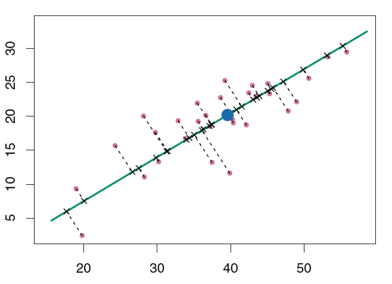

```{r, setup, include=FALSE}
knitr::opts_knit$set(root.dir = 'C:/Users/neide/Documents/GitHub/ma189/Data')
```

# Overview

- In previous lectures we introduced three types of methods for supervised classification:

1. Discriminant analysis
2. Logistic regression
3. Support vector machine

- Here we study a *dimension reduction technique* called *principal component analysis* (PCA).

## High-Dimensional Datasets

- Most classical statistical techniques for regression and classification are intended for low-dimensional settings in which $n$, the number of observations, is much larger than $p$, the number of features.
- In the early stages of many scientific fields, the collected data is multivariate but low-dimensional. In the past, it was technically difficult to collect, store, and compute huge datasets.
- In the past two decades, new technologies have changed the way in which data are collected in fields ranging from medicine, finance, to marketing and social networks.
- It is now commonplace to collect (and store) as many features as possible ($p$ very large). While $p$ is growing fast, the number of observations $n$ is often limited due to cost, sample availability, and issues of privacy.

### Example: Statistical Model for Obesity

#### Obesity Model in 1970

- The classic BMI (body mass index) model was estimated on the base of age, gender, height and weight data collected from a group of roughly 200 people.
- So $n=200$ and $p=4$.

#### Obesity Model in 2010

- The modern obesity model also collects measurements for half a million of genetic variations from people, for inclusion in the predictive model.
- So with the same $n=200$, now we have $p \approx 500,000$.

## Dimension Reduction

- To understand and analyze high-dimensional dataset in a meaningful way, we would often need to seek a low-dimensional representation of the data to which classical statistical learning tools can be applied.
- A popular approach, named *dimension reduction*, involves projecting the $p$ variables onto a $k$-dimensional subspace, where $k < p$.
- This is achieved by computing $k$ different linear combinations, or projections, of the $p$ variables. Then these $k$ projections are used as predictors to fit various statistical models.

## Why Can We Reduce Dimensions?

- Roughly speaking, dimension reduction means we can approximate a $p$-dimensional feature by projecting it onto a lower dimensional space without losing too much information.
- When we have strong correlations between the variables, the data may more or less fall on a line or hyperplane of lower dimensions.
- For instance, imagine a scatterplot of two variables that have a nearly perfect correlation.
- The data points will fall close to a straight line.
- That line could be used as a new (one-dimensional) axis to represent the variation among data points.



### Example: SAT Scores

- Here is a toy example: suppose we have verbal, math, and total SAT scores for a group of students.
- We have three variables, but really (at most) two dimensions in the data because total = verbal + math, meaning that the third variable is completely determined by the first two.
- The reason for saying "at most” two dimensions is that if there is a strong correlation between verbal and math, one dimension might just be enough to describe the data.

## Principal Component Analysis

- Principal components analysis (PCA) is a widely-used approach for extracting a small set of features from a large set of variables, meanwhile retaining most of the information.
- Principal component analysis is a mathematical procedure that transforms many possibly correlated variables into a smaller number of uncorrelated variables called *principal components*.
- The first principal component accounts for as much of the variability in the data as
possible, and each succeeding principal component accounts for as much of the remaining variability as possible.

## Problem Setup

- Suppose we observe a $p$-dimensional random vector
\[
 \underline{x} = {[ x_1, \ldots, x_p ]}^{\prime}
\]
with population covariance matrix $\mbox{Cov} [ \underline{x}] = {\mathbf \Sigma}$.
- Consider linear combinations
\begin{align*}
 y_1 & = e_{11} x_1 + e_{12} x_2 + \ldots + e_{1p} x_p  \\
 y_2 & = e_{21} x_1 + e_{22} x_2 + \ldots + e_{2p} x_p  \\
  & \vdots \\
   y_p & = e_{p1} x_1 + e_{p2} x_2 + \ldots + e_{pp} x_p 
\end{align*}
- Each $y_j$ is a linear combination of $\underline{x}$ with coefficients
\[
  \underline{e}_j = {[ e_{j1}, e_{j2}, \ldots, e_{jp}]}^{\prime}.
\]
- Since $y_j$ is a function of data, it is also random and has variance
\[
 \mbox{Var}[ y_j] = \underline{e}_j^{\prime} {\mathbf \Sigma} \underline{e}_j.
\]
- Moreover, $y_j$ and $y_k$ have covariance
\[
 \mbox{Cov}[ y_j, y_k] = \underline{e}_j^{\prime} {\mathbf \Sigma} \underline{e}_k.
\]
- Principal component analysis aims to find the linear combination $y_j$ such that $\mbox{Var} [ y_j]$ is maximized.

## Scaling the Variables

- The magnitude of elements in a covariance matrix ${\mathbf \Sigma}$ cannot be directly used as evidence for the strength of association, since it depends on the measure and scale of two variables.
- If you change the unit of length from meter to kilometer, the value of the variable will be
1,000 times smaller. Then the variance of the variable would be tiny, and we might ignore
this variable when we look for the direction that maximizes the variance.
- Because it is undesirable for the principal components obtained to depend on an arbitrary
choice of scaling, we typically scale each variable to have mean zero and standard deviation one before we perform PCA.

## First Principal Component

- The first principal component is the linear combination of variables that has the largest variance (among all linear combinations). It accounts for as much variation in the data as possible.
- Specifically we define coefficients
\[
  \underline{e}_1 = {[ e_{11}, e_{12}, \ldots, e_{1p}]}^{\prime}
\]
for the first principal component as the vector that maximizes
\[
 \mbox{Var}[ y_1] = \underline{e}_1^{\prime} {\mathbf \Sigma} \underline{e}_1
\]
subject to (as a direction vector)
\[
  \underline{e}_1^{\prime} \underline{e}_1 =1.
\]

## Second Principal Component

- The second principal component is the linear combination of variables that accounts for as much of the remaining variation as possible, and is uncorrelated with the first component.
- Select
\[
  \underline{e}_2 = {[ e_{21}, e_{22}, \ldots, e_{2p}]}^{\prime}
\]
for the second principal component that maximizes
\[
 \mbox{Var}[ y_2] = \underline{e}_2^{\prime} {\mathbf \Sigma} \underline{e}_2
\]
subject to
\[
  \underline{e}_2^{\prime} \underline{e}_2 =1
\]
and the additional constraint that these two components are uncorrelated:
\[
 \mbox{Cov}[ y_1, y_2] = \underline{e}_1^{\prime} {\mathbf \Sigma} \underline{e}_2 = 0.
\]

## $j$th Principal Component

- For $j \geq 2$, select
\[
  \underline{e}_j = {[ e_{j1}, e_{j2}, \ldots, e_{jp}]}^{\prime}
\]
for the $j$th principal component that maximizes
\[
 \mbox{Var}[ y_j] = \underline{e}_j^{\prime} {\mathbf \Sigma} \underline{e}_j
\]
subject to
\[
  \underline{e}_j^{\prime} \underline{e}_j =1,
\]
and that this new component is uncorrelated with all the previous ones:
\begin{align*}
  \mbox{Cov}[ y_1, y_j] & = \underline{e}_1^{\prime} {\mathbf \Sigma} \underline{e}_j = 0 \\
  \mbox{Cov}[ y_2, y_j] & = \underline{e}_2^{\prime} {\mathbf \Sigma} \underline{e}_j = 0 \\
 & \vdots \\
   \mbox{Cov}[ y_{j-1}, y_j] & = \underline{e}_{j-1}^{\prime} {\mathbf \Sigma} \underline{e}_j = 0.
  \end{align*}

## Interpretation of Principal Components

- The first principal component loading vector has a geometric interpretation: it is the line in ${\mathbf R}^p$ that is closest to the $n$ observations under the average squared Euclidean distance.
- We seek a single direction along which the univariate projections are as close as possible to all the data points, and therefore provides a good summary of the data.
- Consider this plot below. The blue dot is the sample mean. The green solid line is the first principal component. The dashed lines indicate the distance between each observation and the first principal component loading vector.





- The first two principal components span the plane that is closest to the $n$ observations
under average squared Euclidean distance.


