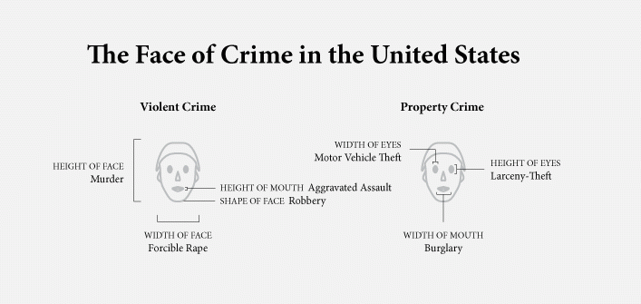
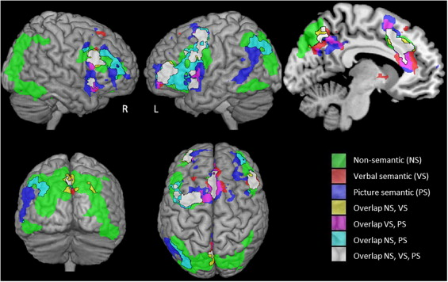

 
```{r, setup, include=FALSE}
knitr::opts_knit$set(root.dir = 'C:/Users/neide/Documents/GitHub/ma189/Data')
```

# Challenges in Multivariate Data Analysis

## Objectives: 
What is the scientific or social problem of interest? How can it be parsed as a multivariate analysis problem? 

## Dataset: 
Data is noisy (it has *randomness*). 

- Measurement error.  (Human or machine.) 
- Missing data. Corruption of data.
- Normality versus extreme-value.
- Homogeneity vs Heterogeneity.

## Methodology:
Which method should we use? What are the assumptions, and are they met? Are the method statistically accurate? Are they omputationally efficient?

# Exploratory Data Analysis 

An important step in data analysis is exploratory data analysis (EDA).

EDA methods include loading, cleaning, and visualizing the data; descriptive statistics are used to provide quick summaries.

## Benefits of EDA:

1. Check the quality of data: has it been cleaned?  Are there missing data or outliers?
2. Gain a first impression of data: data type, distribution, symmetry, etc.
3. Illustrate analysis results: gain intuition, collaboration, general audience, etc.

# Visualization of Multivariate Data

Why do we look at graphical displays of the data? We need to condense the data (without losing important features) so that we can digest it.

## Visualization may:

1. suggest a plausible model for the data,
2. assess validity of model assumptions,
3. detect outliers or suggest a plausible normalizing transformation

# Scatter Plot

A scatter plot is a data visualization tool that uses dots to represent the values obtained for two different variables.

## Plotted on Cartesian coordinates: 
x-axis is the value of the first variable and y-axis is the value of the second variable.

Used to check the relationship between two variables:

1. Correlation
2. Linear or nonlinear
3. Joint normality
4. Groups

## Example 1: USDA Women's Health Survey

- In 1985, the USDA commissioned a study of women’s nutrition. Nutrient intake was measured for a random sample of 737 women aged 25-50 years.
- The following variables were measured:

1. Calcium (mg)
2. Iron (mg)
3. Protein (g)
4. Vitamin A (μg)
5. Vitamin C (mg)

```{r}
nutrient <- read.table("nutrient.txt")
nutrient$V1=NULL
colnames(nutrient)=c("Calcium", "Iron", "Protein", "Vitamin A", "Vitamin C")
dim(nutrient)
head(nutrient)
```

### Scatter Plot of Calcium Versus Iron

```{r}
plot(x = nutrient$Calcium, y = nutrient$Iron,
     xlab = "Calcium", ylab = "Iron",	 
     main = "Calcium vs Iron")
points(nutrient$Calcium[5],nutrient$Iron[5],col=2,pch=19)
```

Each circle is an observation; the fifth observation is in red.

### Questions About this Plot

- Is there a structure to this plot?
- Are there outliers?
- What model should we use to fit the data?
- Can we model the data using the bivariate normal distribution?

## Data Standardization

- Rescale data from different sources and measures to a "standard" scale
- Avoid comparing apples to oranges
- A common standardization is called the *Z-score* scaling, which scales a random sample to have zero sample mean and unit sample variance.
- For a random sample $x_1, \ldots, x_n$, the Z-score scaling transforms each observation by
\[
 z_i = \frac{x_i - \overline{x}}{s}
\]
where $\overline{x}$ is the **sample mean** and $s$ is **sample standard deviation**.

```{r}
x <- nutrient[,c(2,3)]
z <- x
for(i in 1:2)
{
  z[,i] <- (x[,i] - mean(x[,i]))/sd(x[,i])
}
plot(z[,1],z[,2],xlab=names(nutrient)[1],ylab=names(nutrient)[2],
          main = "Calcium vs Iron (Standardized)")
abline(h=3,col=4)
abline(v=3,col=4)
```

We expect $99.7 \%$ of normal data to be within 3 standard deviations of the mean, or in lower left quadrant given by blue lines; here there are more than expected outliers.

```{r}
length(intersect(seq(1,dim(z)[1])[z[,1] < 3],seq(1,dim(z)[1])[z[,2]< 3]))/dim(z)[1]
```

## Transformation Methods

Sometimes data is "irregular”: non-normal, outliers, skewed, heavy-tailed, etc.

- Data transformation techniques can be used to stabilize variance, so that data more resembles the normal distribution.

- Power transformation:
\[
 y = x^{\alpha} \quad 0 < \alpha < 1
\]

- Log transformation:
\[
  y = \log(x), \; 0 < x
\]
 
### Scatter Plot after Log Transformation

```{r}
x <- log(nutrient[,c(2,3)])
plot(x[,1],x[,2],xlab=names(nutrient)[1],ylab=names(nutrient)[2],
          main = "Calcium vs Iron (Log Transformation)")
```

Less outliers, reduced variance, more normal.


## Scatter Plot for Three Variables

The scatter plot can be extended to visualize the relationship among three different variables, which is called 3d scatter plot.

Plotted on Cartesian coordinates: 

1. x-axis is the value of the first variable
2. y-axis is the value of the second variable
3. z-axis is the value of the third variable

### Calcium, Iron and Protein

- Each red dot represents an observation
1. Calcium on x-axis
2. Iron on y-axis
3. Protein on z-axis

```{r}
library("scatterplot3d")
scatterplot3d(x = nutrient$Calcium, y = nutrient$Iron, z=nutrient$Protein,
              xlab = "Calcium", ylab = "Iron",	zlab="Protein", 
              color="red", pch=20)
```

### 3D Scatter Plot After Log Transformation

- Each blue represents an observation
- More clustered in a “ball” or “ellipse”
- Reduced variance
- Less outliers


```{r}
scatterplot3d(x = log(nutrient$Calcium), y = log(nutrient$Iron), z=log(nutrient$Protein),
              xlab = "Calcium", ylab = "Iron",	zlab="Protein", 
              color="steelblue", pch=20)       
```

### Pros and Cons of 3D Scatter Plot

#### Pros
- Visualization for 3 variables (can be extended to 4)
- Complex relationship rather than pair wise
- Joint sample distribution

#### Cons
- Hard to see unless you rotate it (angle dependent)
- Hard to interpret
- Cannot visualize 5 or more variables

## Pairwise Scatter Plot for More Variables
- The pairwise scatter plot aims to visualize the relationship for each pair of variables in a multivariate dataset.
- A **pairwise scatter plot** is an array of scatter plots, the $(i,j)$th plot in the array is the scatter plot between the $i$th and $j$th variables.


```{r}
pairs(nutrient, pch=20)
```

### Pros and Cons of Pairwise Scatter Plot

#### Pros
- Visualization for many variables simultaneously
- Interpret pairwise relationships 

#### Cons
- No joint relationship for more than 2 variables
- Huge array when the number of variables is large

# Time Plot

A time plot (sometimes called a *time series graph*) displays values versus time. It is similar to a scatter plot, but x-axis is chosen to be time.  

- A time plot is useful to compare the "growth” of multiple variables with respect to time (or some other common index).

- Application of time plot:

1. Finance: compare multiple stock returns versus time
2. Clinical: compare multiple patients versus survival time
3. Biology: compare multiple genome sequences versus positions
4. Physics: multiple measurements versus time
5. Economoics: examine unemployment rate and economic indicators over time

## Time Plot for Financial Time Series 

*Time series* are one of the most common data types encountered in finance, economics, and weather forecasting

- Visualization tool: time plot for multiple assets.

- Things to check in a time plot:

1. Co-movement of variables
2. Trend (increasing or decreasing)
3. Periodical patterns (daily, weekly, annual, etc.)
4. **Black swan** event (huge gap, financial crisis, etc.)

## Example 2: Stock Prices of High-tech Companies

- We collect daily stock prices (closing price) of four leading high-tech companies between January 2018 and January 2019; 250 trading days.

- The following variables were included:

1. Daily stock price of Apple
2. Daily stock price of Facebook
3. Daily stock price of IBM
4. Daily stock price of Microsoft

```{r}
stock <- read.table("Stock.csv",sep = ",", header=TRUE)
head(stock)
```

 
 
### Multivariate timeseries plot of stock prices.

```{r}
stock$index <- as.numeric(row.names(stock))
stock <- stock[order(stock$index),]
plot(x = seq(1,250), y = stock$Apple,
     xlab = "Date", ylab = "Stock Price", ylim=c(80,240), xaxt='n',
     main = "Daily Stock Prices in 2018",
     col="red",  type="l", lwd=2)
lines(x = seq(1,250), y = stock$FaceBook, col="blue",  lwd=2)
lines(x = seq(1,250), y = stock$IBM, col="black",  lwd=2)
lines(x = seq(1,250), y = stock$MicroSoft, col="purple",  lwd=2)
axis(1, at = c( 50, 100, 150, 200 ), labels = c("3/27", "6/7", "8/17", "10/29"))
legend("topleft",c("Apple", "FaceBook", "IBM", "MicroSoft"),
       col=c("red", "blue", "black", "purple"), lty=c(1,1,1,1))
```
 
### Questions About this Plot

- Can you observe any co-movement of these four stocks?
- Any trends?
- Which asset is most risky?

### Pros and Cons of Price Data

#### Pros
- Straightforward
- Easy to check trends and high/low prices

#### Cons
- Compare apple to pear
- No relative gain/loss
- Non-stationary data

## Log-return of Financial Assets

- In financial analysis, logarithm of returns is more popular than prices or raw returns.
- For an asset (e.g. stock, bond, gold, bitcoin), **log return** at time $t$ is
\[ 
 r_t = \log (1 + R_t) = \log \left(1 + \frac{ P_t - P_{t-1}}{ P_{t-1}} \right)
  = \log P_{t} - \log P_{t-1},
\]
where $P_t$ and $R_t$  are the price and simple return at time $t$.

## Why Log-return ?

Log-return is favored for multiple reasons:

1. More normal-like distribution (recall log transformation)
2. More stationary time series (zero mean and fixed variance)
3. Log additivity
\[
  \sum_{t=1}^T r_t = \log P_T - \log P_0.
\]
  

### Calculate Daily Log Return for Stock Data

```{r}
Apple_return=diff(log(stock$Apple), lag=1)
FaceBook_return=diff(log(stock$FaceBook), lag=1)
IBM_return=diff(log(stock$IBM), lag=1)
MicroSoft_return=diff(log(stock$MicroSoft), lag=1)
plot(x = seq(1,249), y = Apple_return,
     xlab = "Date", ylab = "Stock Price",  ylim=c(-0.2, 0.1), xaxt='n',
     main = "Daily Stock Returns in 2018",
     col="red",  type="l", lwd=1)
lines(x = seq(1,249), y = FaceBook_return, col="blue",  lwd=1)
lines(x = seq(1,249), y = IBM_return, col="black",  lwd=1)
lines(x = seq(1,249), y = MicroSoft_return, col="purple",  lwd=1)
axis(1, at = c( 50, 100, 150, 200 ), labels = c("3/27", "6/7", "8/17", "10/29"))
legend("bottomleft",c("Apple", "Facebook", "IBM", "Microsoft"),
       col=c("red", "blue", "black", "purple"), lty=c(1,1,1,1))
```

### Questions About this Plot

- Which asset is the most risky (largest "volatility")?
- Can you observe any **black swan** event?  (Drop after warning that revenue growth is slowing)
 
```{r}
stock$Date[1+ which.min(FaceBook_return)]
```

# Radar Chart

- *Radar chart* (also known as spider, web, polar, star chart) is agraphical method of comparing multivariate data in the form of a two-dimensional chart of three or more quantitative variables.
- A radar chart is useful to:

1. Find similar observations
2. Find observation with high/low scores
3. Find clusters of observations
4. Find outliers

## Example 3: High School Final Scores

- We generate a toy dataset. The dataset contains the final scores of some students in a hypothetical high school.
- Suppose the following 8 subjects are tested:

1. Math, 
2. English, 
3. Biology, 
4. Music,
5. Physics, 
6. Statistics

- Each subject is scored from 1 to 10.

### Simulate a Toy Example

```{r}
library(fmsb)
data <- as.data.frame(matrix(sample(2:10, 24, replace=T), ncol=6))
colnames(data) <- c("math", "english", "biology", "music", "physics", "statistics")
head(data)
```

### Radar Chart for 1st Student

- Each axis represents the score in a subject
- Require standardized variables
- The area covered can be considered as a score for overall performance

```{r}
data1 <- data[1,]
# Add a row of 0 and a row of 10 to let the package know the range of data
data1 <- rbind(rep(10,6), rep(0,6), data1)
radarchart(data1, axistype=1, 
     #custom polygon
    pcol=rgb(0.2,0.5,0.5,0.9), pfcol=rgb(0.2,0.5,0.5,0.5), plwd=4, 
     #custom the grid
    cglcol="grey", cglty=1, axislabcol="grey", caxislabels=seq(0,10,2.5), cglwd=0.8,
     #custom labels
    vlcex=0.8)
```


### Comparison on Parallel Charts

Examine a radar chart for each of four students

```{r}
data2 <- data[2,]
data3 <- data[3,]
data4 <- data[4,]
data2 <- rbind(rep(10,6), rep(0,6), data2)
data3 <- rbind(rep(10,6), rep(0,6), data3)
data4 <- rbind(rep(10,6), rep(0,6), data4)
radarchart(data1, axistype=1, 
     #custom polygon
    pcol=rgb(0.2,0.5,0.5,0.9), pfcol=rgb(0.2,0.5,0.5,0.5), plwd=4, 
     #custom the grid
    cglcol="grey", cglty=1, axislabcol="grey", caxislabels=seq(0,10,2.5), cglwd=0.8,
     #custom labels
    vlcex=0.8)
radarchart(data2, axistype=1, 
     #custom polygon
    pcol=rgb(0.2,0.5,0.5,0.9), pfcol=rgb(0.2,0.5,0.5,0.5), plwd=4, 
     #custom the grid
    cglcol="grey", cglty=1, axislabcol="grey", caxislabels=seq(0,10,2.5), cglwd=0.8,
     #custom labels
    vlcex=0.8)
radarchart(data3, axistype=1, 
     #custom polygon
    pcol=rgb(0.2,0.5,0.5,0.9), pfcol=rgb(0.2,0.5,0.5,0.5), plwd=4, 
     #custom the grid
    cglcol="grey", cglty=1, axislabcol="grey", caxislabels=seq(0,10,2.5), cglwd=0.8,
     #custom labels
    vlcex=0.8)
radarchart(data4, axistype=1, 
     #custom polygon
    pcol=rgb(0.2,0.5,0.5,0.9), pfcol=rgb(0.2,0.5,0.5,0.5), plwd=4, 
     #custom the grid
    cglcol="grey", cglty=1, axislabcol="grey", caxislabels=seq(0,10,2.5), cglwd=0.8,
     #custom labels
    vlcex=0.8)

```
 
### Comparison on One Chart

- Draw multiple observations on the same chart
- Easy to compare areas, pros and cons
- Not ideal given a large number of observations 
 
```{r}
data_all <- rbind(rep(10,6), rep(0,6), data)
radarchart(data_all)
```

# Chernoff Face

- *Chernoff faces*, invented by Herman Chernoff in 1973, display multivariate data in the shape of a human face.
- The individual parts, such as eyes, ears, mouth and nose represent values of the variables by their shape, size, placement and orientation.
- The idea behind using faces is that people easily recognize faces and notice small changes without difficulty. 

## Example 4: Crime Rates by State in 2008

- The data contains the rates of various types of crimes in different states. The data source is Table 301 of the 2008 US Statistical Abstract.
- Rates of the following crime types are recorded:

1. Murder 
2. Forcible rape
3. Robbery 
4. Aggravated assault
5. Burglary 
6. Larceny theft
7. Motor vehicle theft



### How to Make a Face?

- Each type of crime corresponds to a character in face.
- Shape of the character depends on the value of each variable


```{r}
library(aplpack)
crime <- read.csv("crimeRatesByState-formatted.csv")
head(crime)
faces(crime[1:9,2:8], face.type = 0, labels=crime$state[1:9], cex=1.5)
```

### Pros and Cons

#### Pros
- Easy to discern and remember the differences between states

#### Cons
- Hard to translate faces back to the value of variables
 
 
```{r} 
faces(crime[1:25,2:8], face.type = 0, labels=crime$state[1:25], cex=1.5)
```

# Heat Map

- A *heat map* (or heatmap) is a visualization tool that represents values in a data matrix by colors in a 2D graph
- Applications of heat map:

1. Molecular biology
2. Neural science
3. Physics
4. Density plot




# Network Map

- A *network map* is a visualization tool used to study the physical connectivity of networks.
- Each node in the map represents a variable (e.g. users, characters, features).
- Two nodes are connected if there is an edge between them.
- An example: Network map for marvel cinematic universe.
https://graphics.straitstimes.com/STI/STIMEDIA/Interactives/2018/04/marvel-cinematic-universe-whos-who-interactive/index.html

